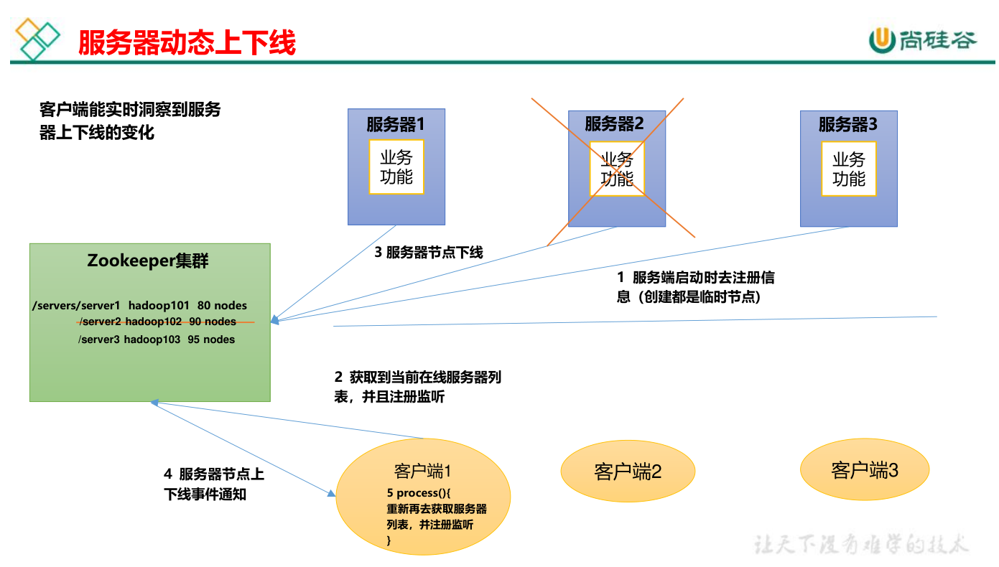
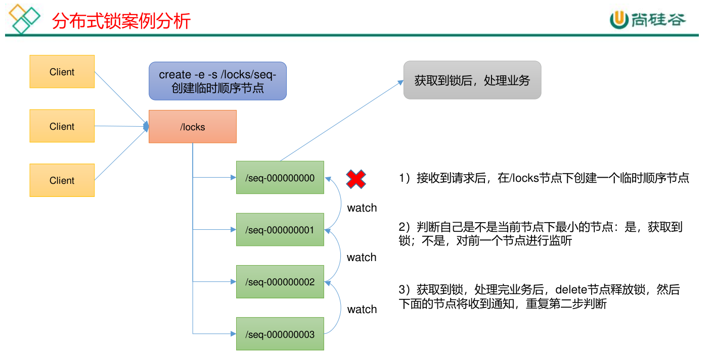

# Zookeeper 学习


## 第 2 章 Zookeeper 本地安装
### 2.1 本地模式安装
#### 1）安装前准备
（1）Linux安装 JDK
（2）拷贝 apache-zookeeper-3.5.7-bin.tar.gz 安装包到 Linux 系统下
（3）解压到指定目录
`tar -zxvf apache-zookeeper-3.5.7-bin.tar.gz -C /opt/module/`

（4）修改目录名称
`mv apache-zookeeper-3.5.7-bin zookeeper-3.5.7`

#### 2）配置修改
（1）将/opt/module/zookeeper-3.5.7/conf 这个路径下的 zoo_sample.cfg 修改为 zoo.cfg；
`mv zoo_sample.cfg zoo.cfg`

（2）打开 zoo.cfg 文件，修改 dataDir 路径：
vim zoo.cfg
修改如下内容：
`dataDir=/opt/module/zookeeper-3.5.7/zkData`

（3）在/opt/module/zookeeper-3.5.7/这个目录上创建 zkData 文件夹
`mkdir zkData`

#### 3）操作 Zookeeper
（1）启动 Zookeeper
`bin/zkServer.sh start`

（2）查看进程是否启动
```shell
jps

4020 Jps
4001 QuorumPeerMain
```

（3）查看状态
```shell
bin/zkServer.sh status

ZooKeeper JMX enabled by default
Using config: /opt/module/zookeeper-3.5.7/bin/../conf/zoo.cfg
Mode: standalone
```

（4）启动客户端
`bin/zkCli.sh`

（5）退出客户端：
`quit`

（6）停止 Zookeeper
`bin/zkServer.sh stop`


### 2.2 配置参数解读
Zookeeper中的配置文件zoo.cfg中参数含义解读如下：

1）tickTime = 2000：通信心跳时间，Zookeeper服务器与客户端心跳时间，单位毫秒

2）initLimit = 10：LF初始通信时限
Leader和Follower初始连接时能容忍的最多心跳数（tickTime的数量）

3）syncLimit = 5：LF同步通信时限
Leader和Follower之间通信时间如果超过syncLimit * tickTime，Leader认为Follwer死掉，从服务器列表中删除Follwer。

4）dataDir：保存Zookeeper中的数据
注意：默认的tmp目录，容易被Linux系统定期删除，所以一般不用默认的tmp目录。

5）clientPort = 2181：客户端连接端口，通常不做修改。


## 第 3 章 Zookeeper 集群操作
### 3.1 集群操作
#### 3.1.1 集群安装
##### 1）集群规划
在 hadoop102、hadoop103 和 hadoop104 三个节点上都部署 Zookeeper。

##### 2）解压安装
（1）在 hadoop102 解压 Zookeeper 安装包到/opt/module/目录下
`tar -zxvf apache-zookeeper-3.5.7-bin.tar.gz -C /opt/module/`

（2）修改 apache-zookeeper-3.5.7-bin 名称为 zookeeper-3.5.7
`mv apache-zookeeper-3.5.7-bin/zookeeper-3.5.7`

##### 3）配置服务器编号
（1）在/opt/module/zookeeper-3.5.7/这个目录下创建 zkData
`mkdir zkData`

（2）在/opt/module/zookeeper-3.5.7/zkData 目录下创建一个 myid 的文件
`vim myid`
在文件中添加与 server 对应的编号，可以自定义，各个机器唯一不能重复
（注意：上下不要有空行，左右不要有空格）
`2`
注意：添加 myid 文件，一定要在 Linux 里面创建，在 notepad++里面很可能乱码

（3）拷贝配置好的 zookeeper 到其他机器上
`xsync zookeeper-3.5.7`
并分别在 hadoop103、hadoop104 上修改 myid 文件中内容为 3、4

##### 4）配置zoo.cfg文件
（1）重命名/opt/module/zookeeper-3.5.7/conf 这个目录下的 zoo_sample.cfg 为 zoo.cfg
`mv zoo_sample.cfg zoo.cfg`

（2）打开 zoo.cfg 文件
```shell
vim zoo.cfg
#修改数据存储路径配置
dataDir=/opt/module/zookeeper-3.5.7/zkData
#增加如下配置
#######################cluster##########################
server.2=hadoop102:2888:3888
server.3=hadoop103:2888:3888
server.4=hadoop104:2888:3888
```

（3）配置参数解读
`server.A=B:C:D`
A 是一个数字，表示这个是第几号服务器；
集群模式下配置一个文件 myid，这个文件在 dataDir 目录下，这个文件里面有一个数据就是 A 的值，Zookeeper 启动时读取此文件，拿到里面的数据与 zoo.cfg 里面的配置信息比较从而判断到底是哪个 server。
B 是这个服务器的地址；
C 是这个服务器 Follower 与集群中的 Leader 服务器交换信息的端口；
D 是万一集群中的 Leader 服务器挂了，需要一个端口来重新进行选举，选出一个新的Leader，而这个端口就是用来执行选举时服务器相互通信的端口。

（4）同步 zoo.cfg 配置文件
`xsync zoo.cfg`

##### 5）集群操作
（1）分别启动 Zookeeper
`bin/zkServer.sh start`

（2）查看状态
```shell
[atguigu@hadoop102 zookeeper-3.5.7]# bin/zkServer.sh status
JMX enabled by default
Using config: /opt/module/zookeeper-3.5.7/bin/../conf/zoo.cfg
Mode: follower

[atguigu@hadoop103 zookeeper-3.5.7]# bin/zkServer.sh status
JMX enabled by default
Using config: /opt/module/zookeeper-3.5.7/bin/../conf/zoo.cfg
Mode: leader

[atguigu@hadoop104 zookeeper-3.4.5]# bin/zkServer.sh status
JMX enabled by default
Using config: /opt/module/zookeeper-3.5.7/bin/../conf/zoo.cfg
Mode: follower
```
注意：如果只启动了一台，查询状态会显示error


#### 3.1.2 选举机制
##### Zookeeper选举机制——第一次启动
（1）服务器1启动，发起一次选举。服务器1投自己一票。此时服务器1票数一票，不够半数以上（3票），选举无法完成，服务器1状态保持为LOOKING；
（2）服务器2启动，再发起一次选举。服务器1和2分别投自己一票并交换选票信息：**此时服务器1发现服务器2的myid比自己目前投票推举的（服务器1）大**，更改选票为推举服务器2。此时服务器1票数0票，服务器2票数2票，没有半数以上结果，选举无法完成，服务器1，2状态保持LOOKING
（3）服务器3启动，发起一次选举。此时服务器1和2都会更改选票为服务器3。此次投票结果：服务器1为0票，服务器2为0票，服务器3为3票。此时服务器3的票数已经超过半数，服务器3当选Leader。服务器1，2更改状态为FOLLOWING，服务器3更改状态为LEADING；
（4）服务器4启动，发起一次选举。此时服务器1，2，3已经不是LOOKING状态，不会更改选票信息。交换选票信息结果：服务器3为3票，服务器4为1票。此时服务器4服从多数，更改选票信息为服务器3，并更改状态为FOLLOWING；
（5）服务器5启动，同4一样当小弟

- SID：服务器ID。用来唯一标识一台ZooKeeper集群中的机器，每台机器不能重复，和myid一致。
- ZXID：事务ID。ZXID是一个事务ID，用来标识一次服务器状态的变更。在某一时刻，集群中的每台机器的ZXID值不一定完全一致，这和ZooKeeper服务器对于客户端“更新请求”的处理逻辑有关。
- Epoch：每个Leader任期的代号。没有Leader时同一轮投票过程中的逻辑时钟值是相同的。每投完一次票这个数据就会增加

##### Zookeeper选举机制——非第一次启动
（1）当ZooKeeper集群中的一台服务器出现以下两种情况之一时，就会开始进入Leader选举：
- 服务器初始化启动。
- 服务器运行期间无法和Leader保持连接。

（2）而当一台机器进入Leader选举流程时，当前集群也可能会处于以下两种状态：
- 集群中本来就已经存在一个Leader。
对于第一种已经存在Leader的情况，机器试图去选举Leader时，会被告知当前服务器的Leader信息，对于该机器来说，仅仅需要和Leader机器建立连接，并进行状态同步即可。
- 集群中确实不存在Leader。
假设ZooKeeper由5台服务器组成，SID分别为1、2、3、4、5，ZXID分别为8、8、8、7、7，并且此时SID为3的服务器是Leader。某一时刻，3和5服务器出现故障，因此开始进行Leader选举。

选举Leader规则：
①EPOCH大的直接胜出
②EPOCH相同，事务id大的胜出
③事务id相同，服务器id大的胜出

优先级： Epoch > ZXID > SID


#### 3.1.3 ZK 集群启动停止脚本
1）在 集群中某一台机器 的/usr/local/bin/ 目录下创建脚本 zk.sh
`vim zk.sh`
在脚本中编写如下内容
```shell
#!/bin/bash
case $1 in
"start"){
  for i in master-123 node1-124 node2-125
    do
      echo ---------- zookeeper $i 启动 ------------
      ssh $i "/opt/module/zookeeper-3.8.4/bin/zkServer.sh start"
  done
};;
"stop"){
for i in master-123 node1-124 node2-125
  do
    echo ---------- zookeeper $i 停止 ------------
    ssh $i "/opt/module/zookeeper-3.8.4/bin/zkServer.sh stop"
  done
};;
"status"){
for i in master-123 node1-124 node2-125
  do
    echo ---------- zookeeper $i 状态 ------------
    ssh $i "/opt/module/zookeeper-3.8.4/bin/zkServer.sh status"
  done
};;
esac
```

2）增加脚本执行权限
`chmod u+x zk.sh`

3）Zookeeper 集群启动脚本
`zk.sh start`

4）Zookeeper 集群停止脚本
`zk.sh stop`

如果显示 JAVA_HOME is not set and java could not be found in PATH. 错误
需要修改 /zookeeper-3.8.4/bin/中的 zkEnv.sh 文件，添加对应的 JAVA_HOME 路径
在 zkEnv.sh 中添加如下内容
`JAVA_HOME=/opt/java/jdk-17`


## 3.2 客户端命令行操作
#### 3.2.1 命令行语法
| 命令基本语法 | 功能描述 |
| ----------- | -------- |
| help | 显示所有操作命令 |
| ls path | 使用 ls 命令来查看当前 znode 的子节点 [可监听] <br> -w 监听子节点变化 <br> -s 附加次级信息 |
| create | 普通创建 <br> -s 含有序列 <br> -e 临时（重启或者超时消失） |
| get path | 获得节点的值 [可监听] <br> -w 监听节点内容变化 <br> -s 附加次级信息 |
| set | 设置节点的具体值 |
| stat | 查看节点状态 |
| delete | 删除节点 |
| deleteall | 递归删除节点 |

1）启动客户端
`bin/zkCli.sh -server master-123:2181`

2）显示所有操作命令
`help`

#### 3.2.2 znode 节点数据信息
1）查看当前znode中所包含的内容
```shell
ls /

[zookeeper]
```

2）查看当前节点详细数据
```shell
ls -s /

[zookeeper]cZxid = 0x0
ctime = Thu Jan 01 08:00:00 CST 1970
mZxid = 0x0
mtime = Thu Jan 01 08:00:00 CST 1970
pZxid = 0x0
cversion = -1
dataVersion = 0
aclVersion = 0
ephemeralOwner = 0x0
dataLength = 0
numChildren = 1
```

**（1）czxid：创建节点的事务 zxid**
每次修改 ZooKeeper 状态都会产生一个 ZooKeeper 事务 ID。事务 ID 是 ZooKeeper 中所有修改总的次序。每次修改都有唯一的 zxid，如果 zxid1 小于 zxid2，那么 zxid1 在 zxid2 之前发生。
（2）ctime：znode 被创建的毫秒数（从 1970 年开始）
（3）mzxid：znode 最后更新的事务 zxid
（4）mtime：znode 最后修改的毫秒数（从 1970 年开始）
（5）pZxid：znode 最后更新的子节点 zxid
（6）cversion：znode 子节点变化号，znode 子节点修改次数
**（7）dataversion：znode 数据变化号**
（8）aclVersion：znode 访问控制列表的变化号
（9）ephemeralOwner：如果是临时节点，这个是 znode 拥有者的 session id。如果不是临时节点则是 0。
**（10）dataLength：znode 的数据长度**
**（11）numChildren：znode 子节点数量**


#### 3.2.3 节点类型（持久/短暂/有序号/无序号）
持久（Persistent）：客户端和服务器端断开连接后，创建的节点不删除
短暂（Ephemeral）：客户端和服务器端断开连接后，创建的节点自己删除

（1）持久化目录节点
客户端与Zookeeper断开连接后，该节点依旧存在
（2）持久化顺序编号目录节点
客户端与Zookeeper断开连接后，该节点依旧存在，只是Zookeeper给该节点名称进行顺序编号
（3）临时目录节点
客户端与Zookeeper断开连接后，该节点被删除
（4）临时顺序编号目录节点
客户端与 Zookeeper 断开连接后，该节点被删除，只是Zookeeper给该节点名称进行顺序编号。

说明：创建znode时设置顺序标识，znode名称后会附加一个值，顺序号是一个单调递增的计数器，由父节点维护
注意：在分布式系统中，顺序号可以被用于为所有的事件进行全局排序，这样客户端可以通过顺序号推断事件的顺序

##### 案例
1）分别创建2个普通节点（永久节点 + 不带序号）
```shell
create /sanguo "diaochan"
create /sanguo/shuguo "liubei"
```

2）获得节点的值
```shell
get -s /sanguo diaochan

cZxid = 0x100000003
ctime = Wed Aug 29 00:03:23 CST 2018
mZxid = 0x100000003
mtime = Wed Aug 29 00:03:23 CST 2018
pZxid = 0x100000004
cversion = 1
dataVersion = 0
aclVersion = 0
ephemeralOwner = 0x0
dataLength = 7
numChildren = 1
```
```shell
get -s /sanguo/shuguo liubei

cZxid = 0x100000004
ctime = Wed Aug 29 00:04:35 CST 2018
mZxid = 0x100000004
mtime = Wed Aug 29 00:04:35 CST 2018
pZxid = 0x100000004
cversion = 0
dataVersion = 0
aclVersion = 0
ephemeralOwner = 0x0
dataLength = 6
numChildren = 0
```

3）创建带序号的节点（永久节点 + 带序号）
（1）先创建一个普通的根节点/sanguo/weiguo
```shell
create /sanguo/weiguo "caocao"

Created /sanguo/weiguo
```

（2）创建带序号的节点
```shell
create -s /sanguo/weiguo/zhangliao "zhangliao"
# 输出
Created /sanguo/weiguo/zhangliao0000000000


create -s /sanguo/weiguo/zhangliao "zhangliao"
# 输出
Created /sanguo/weiguo/zhangliao0000000001


create -s /sanguo/weiguo/xuchu "xuchu"
# 输出
Created /sanguo/weiguo/xuchu0000000002
```
如果原来没有序号节点，序号从 0 开始依次递增。如果原节点下已有 2 个节点，则再排序时从 2 开始，以此类推。

4）创建短暂节点（短暂节点 + 不带序号 or 带序号）
（1）创建短暂的不带序号的节点
```shell
create -e /sanguo/wuguo "zhouyu"

Created /sanguo/wuguo
```

（2）创建短暂的带序号的节点
```shell
create -e -s /sanguo/wuguo "zhouyu"

Created /sanguo/wuguo0000000001
```

（3）在当前客户端是能查看到的
```shell
ls /sanguo

[wuguo, wuguo0000000001, shuguo]
```

（4）退出当前客户端然后再重启客户端
```shell
quit
bin/zkCli.sh
```

（5）再次查看根目录下短暂节点已经删除
```shell
[zk: localhost:2181(CONNECTED) 0] ls /sanguo

[shuguo]
```

5）修改节点数据值
`set /sanguo/weiguo "simayi"`


#### 3.2.4 监听器原理
客户端注册监听它关心的目录节点，当目录节点发生变化（数据改变、节点删除、子目录节点增加删除）时，ZooKeeper 会通知客户端。监听机制保证 ZooKeeper 保存的任何的数据的任何改变都能快速的响应到监听了该节点的应用程序。

##### 概述
1）首先要有一个main()线程
2）在main线程中创建Zookeeper客户端，这时就会创建两个线
程，一个负责网络连接通信（connet），一个负责监听（listener）。
3）通过connect线程将注册的监听事件发送给Zookeeper。
4）在Zookeeper的注册监听器列表中将注册的监听事件添加到列表中。
5）Zookeeper监听到有数据或路径变化，就会将这个消息发送给listener线程。
6）listener线程内部调用了process()方法。

常见的监听
1）监听节点数据的变化
get path [watch]

2）监听子节点增减的变化
ls path [watch]


##### 案例
1）节点的值变化监听
（1）在 hadoop104 主机上注册监听/sanguo 节点数据变化
`get -w /sanguo`

（2）在 hadoop103 主机上修改/sanguo 节点的数据
`set /sanguo "xisi"`

（3）观察 hadoop104 主机收到数据变化的监听
```shell
WATCHER::
WatchedEvent  state:SyncConnected   type:NodeDataChanged
path:/sanguo
```
注意：在hadoop103再多次修改/sanguo的值，hadoop104上不会再收到监听。因为注册一次，只能监听一次。想再次监听，需要再次注册。

2）节点的子节点变化监听（路径变化）
（1）在 hadoop104 主机上注册监听/sanguo 节点的子节点变化
```shell
ls -w /sanguo

[shuguo, weiguo]
```

（2）在 hadoop103 主机/sanguo 节点上创建子节点
```shell
create /sanguo/jin "simayi"

Created /sanguo/jin
```

（3）观察 hadoop104 主机收到子节点变化的监听
```shell
WATCHER::
WatchedEvent  state:SyncConnected   type:NodeChildrenChanged
path:/sanguo
```
注意：节点的路径变化，也是注册一次，生效一次。想多次生效，就需要多次注册。


#### 3.2.5 节点删除与查看
1）删除节点
`delete /sanguo/jin`

2）递归删除节点
`deleteall /sanguo/shuguo`

3）查看节点状态
```shell
stat /sanguo

cZxid = 0x100000003
ctime = Wed Aug 29 00:03:23 CST 2018
mZxid = 0x100000011
mtime = Wed Aug 29 00:21:23 CST 2018
pZxid = 0x100000014
cversion = 9
dataVersion = 1
aclVersion = 0
ephemeralOwner = 0x0
dataLength = 4
numChildren = 1
```


### 3.3 客户端 API 操作
前提：保证 hadoop102、hadoop103、hadoop104 服务器上 Zookeeper 集群服务端启动。

#### 3.3.1 IDEA 环境搭建
1）创建一个工程：zookeeper

2）添加pom文件
```xml
<dependencies>
  <dependency>
    <groupId>junit</groupId>
    <artifactId>junit</artifactId>
    <version>RELEASE</version>
  </dependency>
  <dependency>
    <groupId>org.apache.logging.log4j</groupId>
    <artifactId>log4j-core</artifactId>
    <version>2.8.2</version>
  </dependency>
  
  <dependency>
    <groupId>org.apache.zookeeper</groupId>
    <artifactId>zookeeper</artifactId>
    <version>3.5.7</version>
  </dependency>
</dependencies>
```

3）拷贝log4j.properties文件到项目根目录
需要在项目的 src/main/resources 目录下，新建一个文件，命名为“log4j.properties”，在文件中填入以下内容
```
log4j.rootLogger=INFO, stdout
log4j.appender.stdout=org.apache.log4j.ConsoleAppender
log4j.appender.stdout.layout=org.apache.log4j.PatternLayout
log4j.appender.stdout.layout.ConversionPattern=%d %p [%c]- %m%n
log4j.appender.logfile=org.apache.log4j.FileAppender
log4j.appender.logfile.File=target/spring.log
log4j.appender.logfile.layout=org.apache.log4j.PatternLayout
log4j.appender.logfile.layout.ConversionPattern=%d %p [%c]- %m%n
```

4）创建包com.atguigu.zk

5）创建类名称zkClient

#### 3.3.2 创建 ZooKeeper 客户端
zkClient.java
```java
// 注意：逗号前后不能有空格
private static String connectString = "hadoop102:2181,hadoop103:2181,hadoop104:2181";
private static int sessionTimeout = 2000;
private ZooKeeper zkClient = null;

@Before
public void init() throws IOException {
  zkClient = new ZooKeeper(connectString, sessionTimeout, new Watcher() {
    @Override
    public void process(WatchedEvent watchedEvent) {
      System.out.println("----------------------------");
      List<String> children = null;
      try {
        children = zkClient.getChildren("/", true);
        for (String child : children) {
          System.out.println(child);
        }
        System.out.println("----------------------------");
      } catch (KeeperException e) {
        throw new RuntimeException(e);
      } catch (InterruptedException e) {
        throw new RuntimeException(e);
      }
    }
  });
}
```

#### 3.3.3 创建子节点
```java
// 创建子节点
@Test
public void create() throws InterruptedException, KeeperException {
  // 参数1：要创建的节点的路径； 参数2：节点数据（字节类型）； 参数3：节点权限；参数4：节点的类型
  String nodeCreated = zkClient.create("/zktest", "test".getBytes(), ZooDefs.Ids.OPEN_ACL_UNSAFE, CreateMode.PERSISTENT);
}
```

测试：在 hadoop102 的 zk 客户端上查看创建节点情况
```shell
[zk: localhost:2181(CONNECTED) 16] get -s /atguigu

shuaige
```

#### 3.3.4 获取子节点并监听节点变化
```java
// 获取子节点
@Test
public void getChildren() throws InterruptedException, KeeperException {
  List<String> children = zkClient.getChildren("/", true);
  
  for (String child : children) {
    System.out.println(child);
  }
  // 延时
  Thread.sleep(Long.MAX_VALUE);
}
```

（1）在 IDEA 控制台上看到如下节点：
```shell
zookeeper
sanguo
atguigu
```

（2）在 hadoop102 的客户端上创建再创建一个节点/atguigu1，观察 IDEA 控制台
`[zk: localhost:2181(CONNECTED) 3] create /atguigu1 "atguigu1"`

（3）在 hadoop102 的客户端上删除节点/atguigu1，观察 IDEA 控制台
`[zk: localhost:2181(CONNECTED) 4] delete /atguigu1`


#### 3.3.5 判断 Znode 是否存在
```java
// 判断 znode 是否存在
@Test
public void exist( ) throws InterruptedException, KeeperException {
  Stat stat = zkClient.exists("/zktest", false);
  
  System.out.println(stat == null ? "not exist" : "exist");
}
```


### 第 4 章 服务器动态上下线监听案例
### 4.1 需求
某分布式系统中，主节点可以有多台，可以动态上下线，任意一台客户端都能实时感知到主节点服务器的上下线。


### 4.2 需求分析



### 具体实现
（1）先在集群上创建/servers 节点
```shell
[zk: localhost:2181(CONNECTED) 10] create /servers "servers"
Created /servers
```

（2）在 Idea 中创建包名：com.atguigu.zkcase1

（3）服务器端向 Zookeeper 注册代码
DistributeServer.java
```java
package com.zktest.zkcase1;

import org.apache.zookeeper.*;
import java.io.IOException;

public class DistributeServer {
  private String connectString = "192.168.255.123:2181,192.168.255.124:2181,192.168.255.125:2181";
  private int sessionTimeout = 2000;
  private ZooKeeper zkClient;


  public static void main(String[] args) throws IOException, InterruptedException, KeeperException {
    DistributeServer server = new DistributeServer();
    // 1 获取zk连接
    server.getConnection();

    // 2 注册服务器到zk集群
    server.regist(args[0]);

    // 3 启动业务逻辑（sleep）
    server.business();
  }

  // 业务功能
  private void business() throws InterruptedException {
    Thread.sleep(Long.MAX_VALUE);
  }

  // 注册服务器
  private void regist(String hostname) throws InterruptedException, KeeperException {
    String create = zkClient.create("/servers/" + hostname,
        hostname.getBytes(),
        ZooDefs.Ids.OPEN_ACL_UNSAFE,
        CreateMode.EPHEMERAL_SEQUENTIAL);

    System.out.println(hostname + " is online");
  }

  // 创建到 zk 的客户端连接
  private void getConnection() throws IOException {
    zkClient = new ZooKeeper(connectString, sessionTimeout, new Watcher() {
      @Override
      public void process(WatchedEvent watchedEvent) {

      }
    });
  }
}
```

（3）客户端代码
DistributeClient.java
```java
package com.zktest.zkcase1;

import org.apache.zookeeper.KeeperException;
import org.apache.zookeeper.WatchedEvent;
import org.apache.zookeeper.Watcher;
import org.apache.zookeeper.ZooKeeper;

import java.io.IOException;
import java.util.ArrayList;
import java.util.List;

public class DistributeClient {
  private String connectString = "192.168.255.123:2181,192.168.255.124:2181,192.168.255.125:2181";
  private int sessionTimeout = 2000;
  private ZooKeeper zkClient;

  public static void main(String[] args) throws IOException, InterruptedException, KeeperException {
    DistributeClient client = new DistributeClient();
    // 1 获取zk连接
    client.getConnection();

    // 2 监听/server下子节点的增加和删除
    client.getServerList();

    // 3 启动业务逻辑（sleep）
    client.business();
  }

  // 业务功能
  private void business() throws InterruptedException {
    Thread.sleep(Long.MAX_VALUE);
  }

  // 获取服务器列表信息
  private void getServerList() throws InterruptedException, KeeperException {
    // 1 获取服务器子节点信息，并且对父节点进行监听
    List<String> children = zkClient.getChildren("/servers", true);

    // 2 存储服务器信息列表
    ArrayList<String> servers = new ArrayList<>();

    // 3 遍历所有节点，获取节点中的主机名称信息
    for (String child : children) {
//      System.out.println(child + "    bbbbbbbbbbb");
      // 获取节点名称
      byte[] data = zkClient.getData("/servers/" + child, false, null);

      servers.add(new String(data));
    }

    // 4 打印服务器列表信息
    System.out.println(servers);

  }

  // 创建到 zk 的客户端连接
  private void getConnection() throws IOException {
    zkClient = new ZooKeeper(connectString, sessionTimeout, new Watcher() {
      @Override
      public void process(WatchedEvent watchedEvent) {
        // 再次启动监听
        try {
          getServerList();
        } catch (InterruptedException e) {
          throw new RuntimeException(e);
        } catch (KeeperException e) {
          throw new RuntimeException(e);
        }
      }
    });
  }
}
```


### 4.4 测试
1）在 Linux 命令行上操作增加减少服务器
（1）启动 DistributeClient 客户端

（2）在 hadoop102 上 zk 的客户端/servers 目录上创建临时带序号节点
```shell
[zk:localhost:2181(CONNECTED) 1] create -e -s /servers/hadoop102 "hadoop102"
[zk:localhost:2181(CONNECTED) 2] create -e -s /servers/hadoop103 "hadoop103"
```
（3）观察 Idea 控制台变化
`[hadoop102, hadoop103]`

（4）执行删除操作
`[zk:localhost:2181(CONNECTED) 8] delete /servers/hadoop1020000000000`

（5）观察 Idea 控制台变化
`[hadoop103]`


2）在 Idea 上操作增加减少服务器
（1）启动 DistributeClient 客户端（如果已经启动过，不需要重启）

（2）启动 DistributeServer 服务
①点击 Edit Configurations…
②在弹出的窗口中（Program arguments）输入想启动的主机，例如，hadoop102
③ 回到 DistributeServer 的 main 方法，右键，在弹出的窗口中点击 Run“DistributeServer.main()”
④观察 DistributeServer 控制台，提示 hadoop102 is working
⑤观察 DistributeClient 控制台，提示 hadoop102 已经上线


## 第 5 章 ZooKeeper 分布式锁案例
什么叫做分布式锁呢？
比如说"进程 1"在使用该资源的时候，会先去获得锁，"进程 1"获得锁以后会对该资源保持独占，这样其他进程就无法访问该资源，"进程 1"用完该资源以后就将锁释放掉，让其他进程来获得锁，那么通过这个锁机制，我们就能保证了分布式系统中多个进程能够有序的访问该临界资源。那么我们把这个分布式环境下的这个锁叫作分布式锁。



### 5.1 原生 Zookeeper 实现分布式锁案例
1）分布式锁实现
DistributedLock.java
```java
package com.zktest.zkcase2;

import org.apache.zookeeper.*;
import org.apache.zookeeper.data.Stat;

import java.io.IOException;
import java.util.Collections;
import java.util.List;
import java.util.concurrent.CountDownLatch;

public class DistributedLock {
  private String connectString = "192.168.255.123:2181,192.168.255.124:2181,192.168.255.125:2181";

  // 超时时间
  private int sessionTimeout = 2000;

  private ZooKeeper zkClient;

  // client 等待的子节点名称
  private String waitPath;
  // 当前节点路径
  private String currentNodePath;

  // ZooKeeper 连接等待
  private CountDownLatch connectLatch = new CountDownLatch(1);
  // ZooKeeper 节点等待
  private CountDownLatch waitLatch = new CountDownLatch(1);

  // 和 zk 服务建立连接，并创建根节点
  public DistributedLock() throws InterruptedException, IOException, KeeperException {
    // 获取连接
    zkClient = new ZooKeeper(connectString, sessionTimeout, new Watcher() {
      @Override
      public void process(WatchedEvent watchedEvent) {
        // 如果zk服务器已经连接上，connectLatch可以释放
        if (watchedEvent.getState() == Event.KeeperState.SyncConnected) {
          connectLatch.countDown();
        }

        // 如果删除的是当前节点的上一个节点，waitLatch可以释放
        if (watchedEvent.getType() == Event.EventType.NodeDeleted &&
            watchedEvent.getPath().equals(waitPath)) {
          waitLatch.countDown();
        }
      }
    });

    // zk连接是异步操作，因此需要等待连接完成再继续下面的操作
    connectLatch.await();

    // 判断根节点/locks是否存在
    Stat stat = zkClient.exists("/locks", false);

    // 如果/locks不存在，则进行创建
    if (stat == null) {
      zkClient.create("/locks",
          "/locks".getBytes(),
          ZooDefs.Ids.OPEN_ACL_UNSAFE,
          CreateMode.PERSISTENT
      );
    }
  }


  // 对zk加锁
  public void zkLock() throws InterruptedException, KeeperException {
    try {
      // 创建对应的临时带序号节点
      currentNodePath = zkClient.create("/locks" + "/seq-",
          null,
          ZooDefs.Ids.OPEN_ACL_UNSAFE,
          CreateMode.EPHEMERAL_SEQUENTIAL
      );

      // 判断当前创建的临时带序号节点是否为最小序号的节点，如果是则获取到锁；如果不是，需要监听当前节点的前一个节点
      // 获取子节点列表
      List<String> children = zkClient.getChildren("/locks", false);

      // 如果子节点列表长度为1，表示只有一个节点，当前节点直接获取锁
      if (children.size() == 1) {
        return;
      } else {
        // 对子节点进行排序（升序）
        Collections.sort(children);

        // 对当前节点路径进行截取，获取后面的节点名称 seq-0000000 ...
        String nodeName = currentNodePath.substring("/locks/".length());

        // 获取当前节点在子节点列表中的位置
        int index = children.indexOf(nodeName);

        // 如果当前节点在列表中不存在
        if (index == -1) {
          System.out.println("数据异常");
        } else if (index == 0) {
          // 如果当前节点为列表第一个，当前节点直接获取锁
          return;
        } else {
          // 当前节点不是列表第一个，则需要监听前一个节点
          waitPath = "/locks/" + children.get(index - 1);
          zkClient.getData(waitPath, true, null);

          // 等待监听结束
          waitLatch.await();

          // return;
        }
      }
    } catch (KeeperException | InterruptedException e) {
      throw new RuntimeException(e);
    }

  }

  // 解锁
  public void zkUnlock() throws InterruptedException, KeeperException {
    try {
      // 删除节点
      zkClient.delete(currentNodePath, -1);
    } catch (InterruptedException | KeeperException e) {
      throw new RuntimeException(e);
    }
  }
}
```

2）分布式锁测试
DistributedLockTest.java
```java
package com.zktest.zkcase2;

import org.apache.zookeeper.KeeperException;

import java.io.IOException;

public class DistributedLockTest {
  public static void main(String[] args) throws IOException, InterruptedException, KeeperException {
    // 创建分布式锁 1
    final DistributedLock lock1 = new DistributedLock();
    // 创建分布式锁 2
    final DistributedLock lock2 = new DistributedLock();

    new Thread(() -> {
      try {
        lock1.zkLock();
        System.out.println("线程1，获取锁");
        Thread.sleep(5 * 1000);

        lock1.zkUnlock();
        System.out.println("线程1，释放锁");
      } catch (InterruptedException | KeeperException e) {
        throw new RuntimeException(e);
      }
    }).start();

    new Thread(() -> {
      try {
        lock2.zkLock();
        System.out.println("线程2，获取锁");
        Thread.sleep(5 * 1000);

        lock2.zkUnlock();
        System.out.println("线程2，释放锁");
      } catch (InterruptedException | KeeperException e) {
        throw new RuntimeException(e);
      }
    }).start();
  }
}
```


### 5.2 Curator 框架实现分布式锁案例
1）原生的 Java API 开发存在的问题
（1）会话连接是异步的，需要自己去处理。比如使用 CountDownLatch
（2）Watch 需要重复注册，不然就不能生效
（3）开发的复杂性还是比较高的
（4）不支持多节点删除和创建。需要自己去递归

2）Curator 是一个专门解决分布式锁的框架，解决了原生 Java API 开发分布式遇到的问题
详情请查看官方文档：https://curator.apache.org/index.html

3）Curator 案例实操
（1）添加依赖
```xml
<dependency>
  <groupId>org.apache.curator</groupId>
  <artifactId>curator-framework</artifactId>
  <version>5.7.1</version>
</dependency>
<dependency>
  <groupId>org.apache.curator</groupId>
  <artifactId>curator-recipes</artifactId>
  <version>5.7.1</version>
</dependency>
<dependency>
  <groupId>org.apache.curator</groupId>
  <artifactId>curator-client</artifactId>
  <version>5.7.1</version>
</dependency>
```

（2）代码实现
CuratorLockTest.java
```java
package com.zktest.zkcase3;

import org.apache.curator.framework.CuratorFramework;
import org.apache.curator.framework.CuratorFrameworkFactory;
import org.apache.curator.framework.recipes.locks.InterProcessMutex;
import org.apache.curator.retry.ExponentialBackoffRetry;

public class CuratorLockTest {
  public static void main(String[] args) {
    InterProcessMutex lock1 = new InterProcessMutex(getCuratorFramework(), "/locks");
    InterProcessMutex lock2 = new InterProcessMutex(getCuratorFramework(), "/locks");

    new Thread(() -> {
      try {
        lock1.acquire();
        System.out.println("线程1，获取锁");

        lock1.acquire();
        System.out.println("线程1，再次获取锁");

        Thread.sleep(5 * 1000);

        lock1.release();
        System.out.println("线程1，释放锁");

        lock1.release();
        System.out.println("线程1，再次释放锁");

      } catch (Exception e) {
        throw new RuntimeException(e);
      }
    }).start();

    new Thread(() -> {
      try {
        lock2.acquire();
        System.out.println("线程2，获取锁");

        lock2.acquire();
        System.out.println("线程2，再次获取锁");

        Thread.sleep(5 * 1000);

        lock2.release();
        System.out.println("线程2，释放锁");

        lock2.release();
        System.out.println("线程2，再次释放锁");

      } catch (Exception e) {
        throw new RuntimeException(e);
      }
    }).start();

  }

  // 分布式锁初始化
  private static CuratorFramework getCuratorFramework() {
    // 重试策略，初试时间 3 秒，重试 3 次
    ExponentialBackoffRetry policy = new ExponentialBackoffRetry(
        3000, 3);

    // 通过工厂创建 Curator
    CuratorFramework client = CuratorFrameworkFactory.builder()
        .connectString("192.168.255.123:2181,192.168.255.124:2181,192.168.255.125:2181")
        .connectionTimeoutMs(2000)
        .sessionTimeoutMs(2000)
        .retryPolicy(policy)
        .build();

    // 开启连接
    client.start();
    System.out.println("zookeeper start");

    return client;
  }
}
```


# 附加

## 安装java
1 下载jdk包，上传到虚拟机中

2 解压jdk包到指定位置
`tar -zxvf jdk-17_linux-x64_bin.tar.gz -C /opt/java`

3 设置环境变量
修改profile文件
`vim /etc/profile`
在文件中添加内容
```shell
export JAVA_HOME=/opt/java/jdk-17
export PATH=$PATH:$JAVA_HOME/bin
```
注意：其中 JAVA_HOME 要配置的是java的实际安装路径

4 使添加内容生效
使用 `source /etc/profile` 命令， 或直接重启

5 测试是否安装成功
`java -version`


## xsync分发文件
1 配置集群hostname
在文件中配置ip地址和对应的主机名
`vim /etc/hosts`
```shell
192.168.255.123 master-123
192.168.255.124 node1-124
192.168.255.125 node2-125
```

2 安装 rsync远程同步工具
`apt-get install rsync`

3 修改 /usr/local/bin/ 下的 xsync 文件，如果没有就新建
```shell
p1=$1
fname=`basename $p1`
echo fname=$fname

#3 获取上级目录到绝对路径
pdir=`cd -P $(dirname $p1); pwd`
echo pdir=$pdir

#4 获取当前用户名称
user=`whoami`

#5 循环
for((host=123;host<126;host++)); do
        echo ------------------- 192.168.255.$host --------------
        rsync -rvl $pdir/$fname $user@192.168.255.$host:$pdir
done
```

4 修改 xsync 文件权限
`chmod 777 xsync`

5 测试 
使用 xsync +需要分发的文件名（文件夹也可以） 进行分发
```shell
# 语法：xsync [文件名/文件夹名]
xsync a.txt
```


